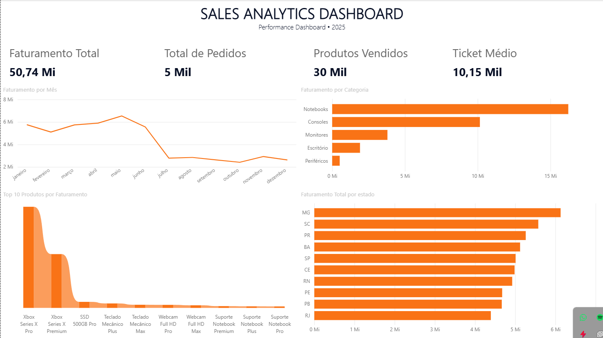
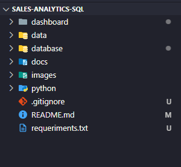
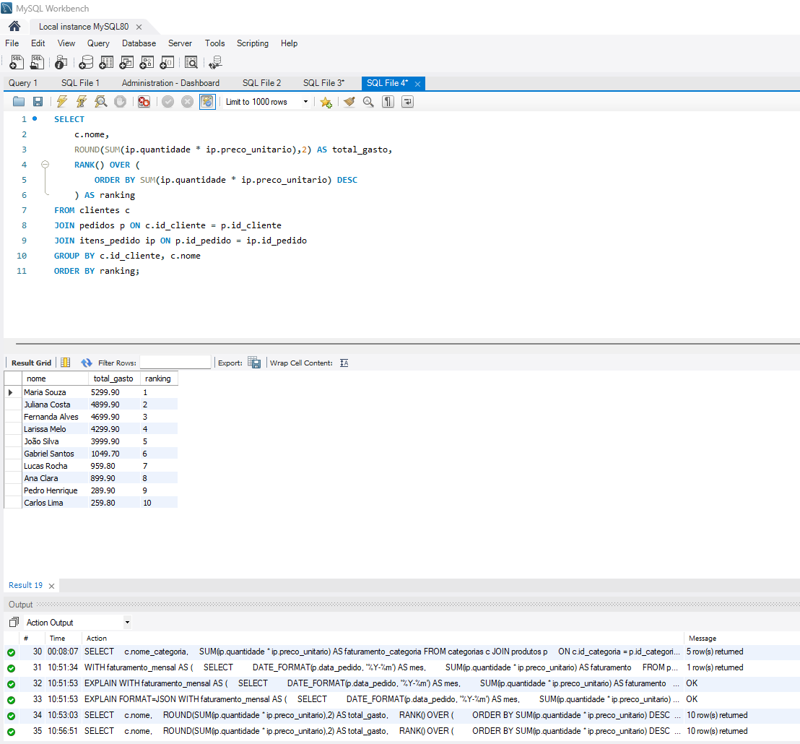

<div align="center">

# 📊 Sales Analytics SQL

### End-to-End Sales Analytics Project with MySQL, SQL and Python


A complete sales analytics project that simulates the daily workflow of a Data Analyst through relational database modeling, SQL business analysis and data processing with Python.

</div>

---

## 📌 Project Overview

This project simulates a retail business environment in which sales data is stored, processed and transformed into actionable business insights.

The solution covers the main stages of an analytical workflow:

- Relational database modeling
- Database creation with MySQL
- Data loading through SQL scripts
- Business analysis with SQL
- Data processing with Python and Pandas
- KPI calculation
- Analytical report generation
- CSV export
- Git and GitHub version control

---
# 📊 Dashboard Power BI

O dashboard foi desenvolvido no Microsoft Power BI para visualizar os principais indicadores de vendas, permitindo uma análise rápida do desempenho comercial.

### Preview


---

## 🎯 Project Objectives

The main objectives of this project are:

- Build a structured relational database
- Analyze sales performance
- Identify the most profitable products and categories
- Rank customers by total spending
- Analyze revenue by period and location
- Monitor inventory levels
- Calculate relevant business KPIs
- Generate reusable datasets and reports

---

## 🏗 Database Structure

```text
Customers
    │
    └── Orders
           │
           └── Order Items
                  │
                  └── Products
                         │
                         └── Categories
```
## 📸 Screenshots

### Project Structure

The project is organized into separate folders for data, SQL scripts, Python analysis, documentation, images, and dashboard files.



---

### SQL Customer Ranking

Example of a business query using `JOIN`, aggregation with `SUM()`, and the `RANK()` window function to identify the customers with the highest total spending.



### Main relationships

- One customer can place multiple orders
- One order can contain multiple items
- Each order item is associated with one product
- Each product belongs to one category

---

## 📂 Project Structure

```text
sales-analytics-sql/

├── data/
│   ├── clientes.csv
│   ├── categorias.csv
│   ├── produtos.csv
│   ├── pedidos.csv
│   ├── itens_pedido.csv
│   ├── vendas_detalhadas.csv
│   └── resultados/
│       ├── faturamento_mensal.csv
│       ├── faturamento_por_categoria.csv
│       ├── faturamento_por_estado.csv
│       ├── top_10_clientes.csv
│       └── top_10_produtos.csv
│
├── database/
│   ├── 01_create_database.sql
│   ├── 02_insert_data.sql
│   └── 03_business_queries.sql
│
├── python/
│   └── analysis.py
│
├── docs/
│   └── GUIA_RAPIDO.md
│
├── dashboard/
│   └── README.md
│
├── .gitignore
├── requirements.txt
└── README.md
```

---

## 📊 Dataset

The project simulates a retail company with a database large enough to support meaningful business analysis.

| Table | Records |
|---|---:|
| Customers | 500 |
| Products | 100 |
| Categories | 10 |
| Orders | 5,000 |
| Order Items | 14,000+ |

---

## 📈 Business Questions Answered

The SQL queries were created to answer common questions requested by managers and business teams.

Examples:

- What is the total revenue?
- How many orders were placed?
- What is the average ticket?
- What is the monthly revenue?
- Which products generate the most revenue?
- Which categories are the most profitable?
- Which customers spend the most?
- Which states generate the most revenue?
- Which customers spend above the average?
- What is the ranking of categories?
- Which products have low inventory?
- What is the monthly revenue growth rate?
- What is the percentage contribution of each category?
- What is the three-month moving average?
- How can customers be segmented by spending?

---

## 🧠 SQL Concepts Applied

The project applies fundamental and advanced SQL concepts:

- `SELECT`
- `WHERE`
- `ORDER BY`
- `GROUP BY`
- `INNER JOIN`
- `LEFT JOIN`
- Aggregate functions
- `SUM()`
- `COUNT()`
- `AVG()`
- `ROUND()`
- `CASE`
- Views
- Common Table Expressions with `WITH`
- Window functions
- `RANK()`
- `DENSE_RANK()`
- `LAG()`
- Moving averages
- Subqueries
- Aliases
- Data segmentation

---

## 🔍 Main SQL Analyses

The file below contains the main business queries:

```text
database/03_business_queries.sql
```

Some of the analyses included are:

- Total revenue
- Total number of orders
- Average ticket
- Monthly revenue
- Top products by revenue
- Revenue by category
- Top customers
- Revenue by state
- Customers above average spending
- Category ranking
- Low-stock products
- Detailed sales view
- Customer ranking
- Customer segmentation
- Monthly growth rate
- Category revenue share
- Three-month moving average

---

## 🐍 Python Analysis

Python was used to process and analyze the project data outside the database environment.

The script performs the following tasks:

- Reads CSV files
- Merges relational datasets
- Creates a detailed sales table
- Calculates business KPIs
- Aggregates revenue by month
- Aggregates revenue by category
- Aggregates revenue by state
- Identifies top products
- Identifies top customers
- Exports analytical reports

### Library used

- Pandas

### Main script

```text
python/analysis.py
```

---

## 📊 Main KPIs

The analysis calculates indicators such as:

- Total revenue
- Total orders
- Average ticket
- Number of customers served
- Revenue by month
- Revenue by category
- Revenue by state
- Top products
- Top customers

---

## 💡 Insights Obtained

The generated data allows the identification of relevant business insights, such as:

- Total revenue above R$ 50 million
- Average ticket above R$ 10 thousand
- Notebooks as the category with the highest revenue
- MacBook Air Plus as one of the highest-revenue products
- Customers with spending above the overall average
- Revenue concentration by product category
- Monthly sales growth and decline periods
- Products with low inventory levels

> The values above are based on the simulated dataset generated for this project.

---

## 📁 Generated Outputs

After running the Python script, the following reports are generated automatically:

```text
data/resultados/

├── faturamento_mensal.csv
├── faturamento_por_categoria.csv
├── faturamento_por_estado.csv
├── top_10_clientes.csv
└── top_10_produtos.csv
```

A consolidated analytical file is also generated:

```text
data/vendas_detalhadas.csv
```

---

## 🚀 How to Run

### 1. Clone the repository

```bash
git clone https://github.com/karlosqwer/sales-analytics-sql.git
```

### 2. Access the project folder

```bash
cd sales-analytics-sql
```

### 3. Install Python dependencies

```bash
pip install -r requirements.txt
```

### 4. Create the database

Run:

```text
database/01_create_database.sql
```

### 5. Insert the data

Run:

```text
database/02_insert_data.sql
```

### 6. Execute the business queries

Run:

```text
database/03_business_queries.sql
```

### 7. Execute the Python analysis

```bash
python python/analysis.py
```

---

## 🛠 Technologies

- MySQL
- SQL
- Python
- Pandas
- Git
- GitHub

---

## 📚 Skills Demonstrated

- Relational database design
- SQL development
- Data modeling
- Data analysis
- Business intelligence
- Data processing with Python
- KPI calculation
- Report generation
- Data aggregation
- Data segmentation
- Window functions
- Git workflow
- Technical documentation

---

## 🔮 Future Improvements

- Power BI dashboard
- Interactive visualizations
- Automated ETL pipeline
- Data warehouse modeling
- Stored procedures
- Triggers
- Index optimization
- Automated data validation
- Docker support
- Unit tests for the Python pipeline

---

## 👨‍💻 Author

**Karlos Eduardo**

GitHub:  
https://github.com/karlosqwer

---

⭐ If this project was useful, consider giving the repository a star.
